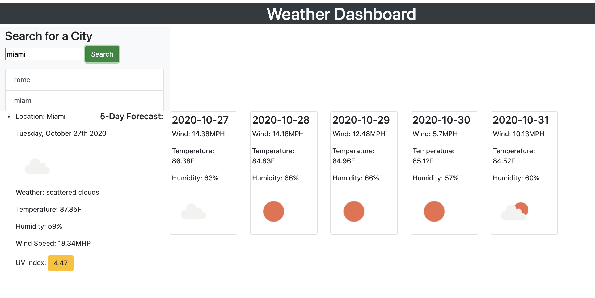

# Travel-Weather-Forecast

This code creates a simple weather outlook for a traveler for multiple cities to prepare for a trip accordingly.

### Screenshots

### Technology

* HTML5 and CSS powered by jQuery
* JavaScript
* The Moment.js library used to work with date and time
* [OpenWeather API](https://openweathermap.org/api) used to retrieve weather data for cities

### Video Resources used for research:

* https://youtu.be/S-gMLzlG_ME
* https://youtu.be/4UoUqnjUC2c
* https://www.epa.gov/sunsafetycalculating-uv-index-0 

### Web Access

Click here for the [Travel-Weather-Forecast] access 
https://marynapr.github.io/Travel-Weather-Forecast/

This document was created by MarynaPR. Feel free to contact me with any questions via email pryadkamaryna@gmail.com.
